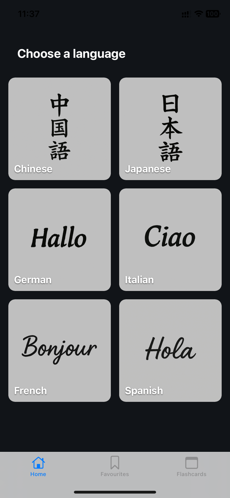

# Word Frequency Learner

A mobile application that helps language learners expand their vocabulary by exploring high-frequency word lists, saving favorites, and studying them using flashcards. Built with Expo (React Native), Zustand, and AsyncStorage.

## 📱 Features

- Select a language to explore its most frequent words
- View word meanings and mark words as favorites
- Practice words using an integrated flashcard system
- Offline functionality using bundled JSON data and local storage
- Favorites are persisted using AsyncStorage

## 🖼️ Screenshots

### Home Screen


### Word List Screen


### Favorites Screen


### Flashcards Screen


## 🧠 Technology Stack

| Tool / Library | Purpose |
|----------------|---------|
| **Expo** | Simplifies React Native development and deployment |
| **Zustand** | Lightweight global state management |
| **AsyncStorage** | Local persistence for favorites |
| **React Navigation** | Tab-based and stack navigation |
| **JSON Data** | Bundled frequency word lists for offline access |

## 📦 Installation

> Prerequisite: [Node.js](https://nodejs.org/) and [Expo CLI](https://docs.expo.dev/get-started/installation/)

```bash
git clone https://github.com/yourusername/word-frequency-learner.git
cd word-frequency-learner
npm install
```

## 🚀 Running the App

```bash
npx expo start
```

Scan the QR code using the Expo Go app on your Android or iOS device.

## 🧪 Manual Test Cases

| Test Case | Steps | Expected Result |
|-----------|-------|-----------------|
| Select a language | Open the app → Tap on a language | Word list for selected language loads |
| Mark a word as favorite | Tap the star icon on a word | Word is added to Favorites screen |
| Unmark a favorite | Tap the star again | Word is removed from Favorites |
| View favorites | Tap on the Favorites tab | All starred words are shown |
| Use flashcards | Tap Flashcards tab → Choose mode | Flashcards load and flip on tap |
| Persist favorites | Restart app after saving words | Favorites remain after restart |

## 📁 Project Structure

```
/app                  → Expo Router pages (screens)
/components           → Shared UI components
/data                 → Bundled JSON word lists
/store                → Zustand state stores
/assets               → App icons, images
README.md             → You’re reading it
```

## 📝 License

This project was developed as part of a university portfolio course. Not licensed for commercial use.